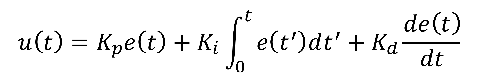

# CarND-Controls-PID
Self-Driving Car Engineer Nanodegree Program

---

PID Controller Project Reflections
==================================


[A video showing the car on a full track can be downloaded here](Media/PID_video.mp4)

Contents
--------

-   Concept

-   Implementation Strategy & Tuning Approach

-   Final Parameter Selection

-   Reflections

Concept
-------

A proportional–integral–derivative controller (PID controller or
three-term controller) is a control loop feedback mechanism widely used
in industrial control systems and a variety of other applications
requiring continuously modulated control. A PID controller continuously
calculates an error value e(t) as the difference between a desired
setpoint (SP) and a measured process variable (PV) and applies a
correction based on proportional, integral, and derivative terms
(denoted P, I, and D respectively), hence the name.

The overall control function can be expressed mathematically as

{:height="50%" width="50%"}


**Coefficients**

-   Kp: is the proportional gain, a tuning parameter. The
    proportional term produces an output value that is proportional to
    the current error value. It is responsible for the Direction and
    magnitude of the correction.

-   Ki: is the integral gain, a tuning parameter. The contribution
    from the integral term is proportional to both the magnitude of the
    error and the duration of the error. It is therefore responsible for
    the elimination of the residual steady-state error.

-   Kd: is the derivative gain, a tuning parameter. The derivative
    component is responsible for increasing the stabilization of the
    system, damping the oscillation.

In Autonomous Driving (AD) field a PID control has lots of applications.
Within this project the PID controls the steering and velocity of a
simulated self-driving car. For the project it was only required to
apply the PID concept to steering control, but it is quite obvious that
to achieve a higher average speed, the speed can’t be constant as it
would be limited by the maximum speed within the curves. The PID
controller for velocity is changing speed depending on the amount of
steering gain required. A basis steering gain parameter has been
heuristically determined which is than modulated by the PID controller
for steering.

Implementation Strategy
-----------------------

Finding initial coefficients that allow to drive a full track is a
little bit tricky. Started with a speed of 35mph and for the
coefficients with (Kp = 0.1, Ki = 0.0001, Kd = 2.0). Further
optimization was a trail and error approach which also involved an
increase in speed over time.

A second PID controller is used to control the speed depending of the
amount of steering. This allows to enable higher speeds when only
minimal steering is required and lowers the speed in curves where larger
absolute steering values are required. This PID uses only the
proportional gain (Kp) all other coefficients are set to zero.

Final Parameter Selection
-------------------------

The finally coefficients for the steering PID are (Kp = 0.097221, Ki =
0.000020, Kd = 5.0). For the velocity PID the coefficients are (Kp =
0.25, Ki = 0.0, Kd = 0.0).

Reflections
-----------

An attempt was made to automate the gain tuning using twiddle. I run
into a limitation of the simulator which does not allow to automatically
restart it from an external application. This prevented an efficient
approach to utilize a twiddle implementation for self-optimization of
the coefficients. I did investigate other approaches to automatically
determine the coefficients of the two PID controllers.


---
## Dependencies

* cmake >= 3.5
 * All OSes: [click here for installation instructions](https://cmake.org/install/)
* make >= 4.1(mac, linux), 3.81(Windows)
  * Linux: make is installed by default on most Linux distros
  * Mac: [install Xcode command line tools to get make](https://developer.apple.com/xcode/features/)
  * Windows: [Click here for installation instructions](http://gnuwin32.sourceforge.net/packages/make.htm)
* gcc/g++ >= 5.4
  * Linux: gcc / g++ is installed by default on most Linux distros
  * Mac: same deal as make - [install Xcode command line tools]((https://developer.apple.com/xcode/features/)
  * Windows: recommend using [MinGW](http://www.mingw.org/)
* [uWebSockets](https://github.com/uWebSockets/uWebSockets)
  * Run either `./install-mac.sh` or `./install-ubuntu.sh`.
  * If you install from source, checkout to commit `e94b6e1`, i.e.
    ```
    git clone https://github.com/uWebSockets/uWebSockets 
    cd uWebSockets
    git checkout e94b6e1
    ```
    Some function signatures have changed in v0.14.x. See [this PR](https://github.com/udacity/CarND-MPC-Project/pull/3) for more details.
* Simulator. You can download these from the [project intro page](https://github.com/udacity/self-driving-car-sim/releases) in the classroom.

Fellow students have put together a guide to Windows set-up for the project [here](https://s3-us-west-1.amazonaws.com/udacity-selfdrivingcar/files/Kidnapped_Vehicle_Windows_Setup.pdf) if the environment you have set up for the Sensor Fusion projects does not work for this project. There's also an experimental patch for windows in this [PR](https://github.com/udacity/CarND-PID-Control-Project/pull/3).

## Basic Build Instructions

1. Clone this repo.
2. Make a build directory: `mkdir build && cd build`
3. Compile: `cmake .. && make`
4. Run it: `./pid`. 

Tips for setting up your environment can be found [here](https://classroom.udacity.com/nanodegrees/nd013/parts/40f38239-66b6-46ec-ae68-03afd8a601c8/modules/0949fca6-b379-42af-a919-ee50aa304e6a/lessons/f758c44c-5e40-4e01-93b5-1a82aa4e044f/concepts/23d376c7-0195-4276-bdf0-e02f1f3c665d)

## Editor Settings

We've purposefully kept editor configuration files out of this repo in order to
keep it as simple and environment agnostic as possible. However, we recommend
using the following settings:

* indent using spaces
* set tab width to 2 spaces (keeps the matrices in source code aligned)

## Code Style

Please (do your best to) stick to [Google's C++ style guide](https://google.github.io/styleguide/cppguide.html).

## Project Instructions and Rubric

Note: regardless of the changes you make, your project must be buildable using
cmake and make!

More information is only accessible by people who are already enrolled in Term 2
of CarND. If you are enrolled, see [the project page](https://classroom.udacity.com/nanodegrees/nd013/parts/40f38239-66b6-46ec-ae68-03afd8a601c8/modules/f1820894-8322-4bb3-81aa-b26b3c6dcbaf/lessons/e8235395-22dd-4b87-88e0-d108c5e5bbf4/concepts/6a4d8d42-6a04-4aa6-b284-1697c0fd6562)
for instructions and the project rubric.

## Hints!

* You don't have to follow this directory structure, but if you do, your work
  will span all of the .cpp files here. Keep an eye out for TODOs.

## Call for IDE Profiles Pull Requests

Help your fellow students!

We decided to create Makefiles with cmake to keep this project as platform
agnostic as possible. Similarly, we omitted IDE profiles in order to we ensure
that students don't feel pressured to use one IDE or another.

However! I'd love to help people get up and running with their IDEs of choice.
If you've created a profile for an IDE that you think other students would
appreciate, we'd love to have you add the requisite profile files and
instructions to ide_profiles/. For example if you wanted to add a VS Code
profile, you'd add:

* /ide_profiles/vscode/.vscode
* /ide_profiles/vscode/README.md

The README should explain what the profile does, how to take advantage of it,
and how to install it.

Frankly, I've never been involved in a project with multiple IDE profiles
before. I believe the best way to handle this would be to keep them out of the
repo root to avoid clutter. My expectation is that most profiles will include
instructions to copy files to a new location to get picked up by the IDE, but
that's just a guess.

One last note here: regardless of the IDE used, every submitted project must
still be compilable with cmake and make./

## How to write a README
A well written README file can enhance your project and portfolio.  Develop your abilities to create professional README files by completing [this free course](https://www.udacity.com/course/writing-readmes--ud777).

